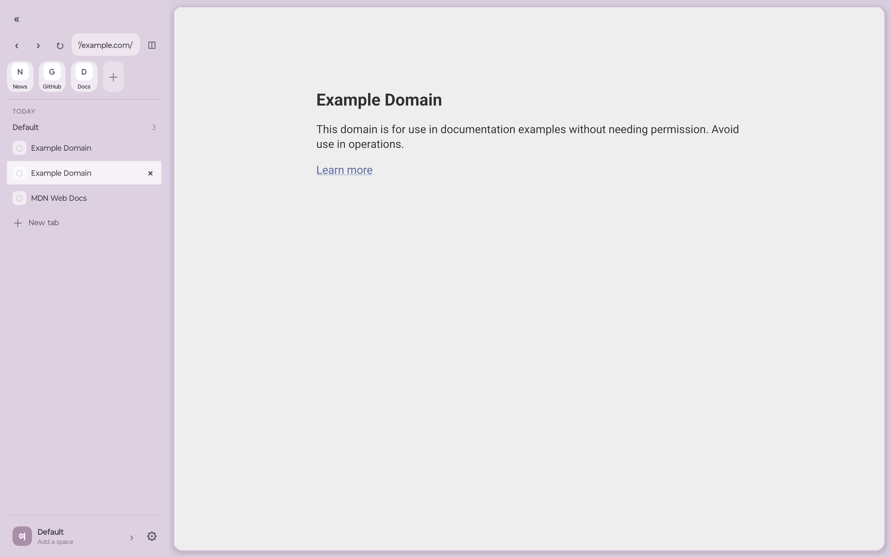
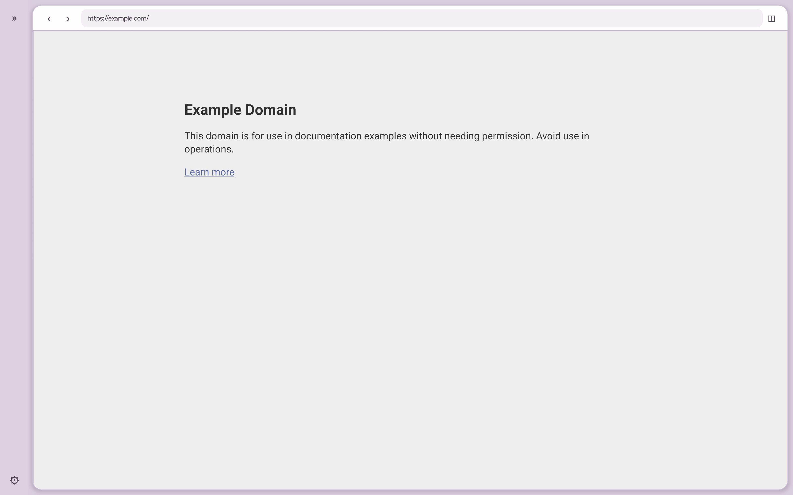
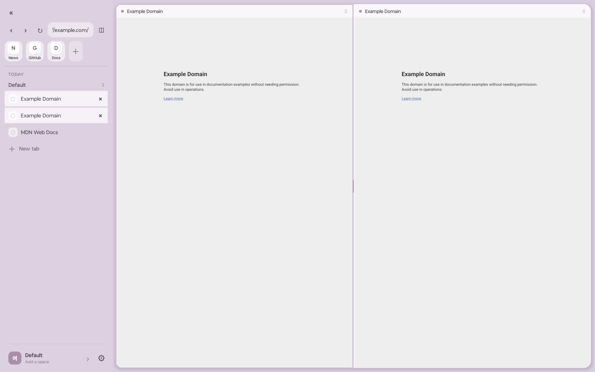

[English](README.md)

<p align="center">
  
</p>

# 여유 · Yeoyu

넓은 화면과 키보드 중심 탐색을 실험하는 Android 태블릿 브라우저입니다. React Native 인터페이스, GeckoView 렌더링, generated JSI 뒤의 Rust 도메인 코어를 결합합니다.

[](https://github.com/loopy-lim/yeoyu/actions/workflows/check.yml)
[](https://github.com/loopy-lim/yeoyu/actions/workflows/android.yml)



> [!WARNING]
> 여유는 제품 출시본이나 보안 감사를 마친 브라우저가 아닌 POC입니다. 공개 APK도 아직 배포하지 않습니다. 시험하기 전에 중요한 브라우징 데이터를 백업하세요.

## 무엇을 실험하나요?

- **Space와 저장된 탐색** — 모든 Space에서 보이는 Favorite, Space별 pinned tab, 폴더, 북마크, 방문 기록, 빠른 열기.
- **태블릿 우선 인터랙션** — 펼치고 접는 사이드바, 가로·세로 분할, 터치 드래그, 마우스 메뉴, 편집 가능한 키보드 단축키.
- **Android 웹 통합** — GeckoView 세션, 사이트 권한, 파일 선택, 다운로드, 외부 링크, 팝업, 미디어 세션, Android PIP.
- **로컬 상태 소유권** — workspace·tab·bookmark·keymap 규칙은 Rust가, 화면과 조정은 React Native가 담당합니다.
- **프라이버시 실험** — 비공개 탭, 추적 보호 설정, 범위를 제한한 가져오기·내보내기, 보수적인 탭 해제 정책.

<p>
  
  
</p>

## 구조 한눈에 보기

```text
React Native UI
      │
BrowserController와 typed port
      ├──────── Android native layer ─────── GeckoView session
      │
      └──────── generated JSI bridge ────── Rust domain core
                                              │
                                        검증된 snapshot
```

브라우저 엔진과 저장 가능한 브라우저 모델을 의도적으로 분리했습니다. Android가 실제 `GeckoSession`을 소유하고, Rust가 직렬화 가능한 ID와 상태 전이를 소유합니다. 경계와 데이터 흐름은 [아키텍처](docs/architecture.ko.md)에서 자세히 설명합니다.

## 요구 사항

- Android 8 / API 26 이상. 현재 UI 대상은 가로 화면 태블릿입니다.
- Node.js 22 (`.node-version`), Bun 1.4.1 (`.bun-version`)
- Rust 1.98 (`rust-toolchain.toml`), `aarch64-linux-android` target
- JDK 17 이상, Android SDK 37.1, Build Tools 37.0.0, NDK 27.1.12297006
- Android 빌드용 `cargo-ndk` 4.1.2

## 빠른 시작

```sh
rustup target add aarch64-linux-android
cargo install cargo-ndk --version 4.1.2 --locked
./scripts/bootstrap.sh
./scripts/check.sh
./scripts/build-android.sh Debug
bun start
```

`bootstrap.sh`는 고정된 [Rustra](https://github.com/loopy-lim/rustra) 소스를 Git에서 제외된 `.deps/`에 내려받고, 의존성을 설치한 뒤 generated binding을 검증합니다. Android 기본 ABI는 `arm64-v8a`입니다.

기기 설치, 빌드 프로필, 환경 변수, 전체 검증 절차는 [개발 가이드](docs/development.ko.md)를 확인하세요.

## 프로젝트 구성

| 경로 | 책임 |
| --- | --- |
| `src/` | React Native 브라우저 chrome, controller, policy, UI 상태 |
| `native/` | Rust workspace/tab/bookmark 도메인과 snapshot 검증 |
| `android/` | GeckoView surface·session registry·Android 연동·앱 shell |
| `modules/rustra-jsi/` | generated Rust-to-React Native bridge runtime |
| `generated/` | generated TypeScript contract와 codec |
| `tests/` | 브라우저 policy·UI·controller·acceptance helper |
| `docs/` | 공개용 아키텍처·개발·프로젝트 상태 문서 |

## 검증

기본 host gate는 Rust formatting/test/Clippy, Bun test, Python check, layout geometry assertion, contrast check, TypeScript, generated-code consistency를 실행합니다.

```sh
./scripts/check.sh
```

Android unit test와 로컬 서명 테스트 APK는 CI에서 별도로 확인합니다. 빌드 성공을 실기기 acceptance나 공개 release로 확대하지 않습니다. 현재 검증 범위와 남은 항목은 [프로젝트 상태](docs/project-status.ko.md)에 정리했습니다.

## 문서

- [문서 안내](docs/README.ko.md)
- [아키텍처](docs/architecture.ko.md)
- [개발과 검증](docs/development.ko.md)
- [프로젝트 상태와 한계](docs/project-status.ko.md)
- [기여 안내](CONTRIBUTING.md)
- [보안 정책](SECURITY.md)

## 현재 상태

여유는 현재 Android POC로만 실행됩니다. iOS browser-surface interface는 있지만 실행 가능한 iOS 앱은 없습니다. 동기화, 확장 프로그램, 저장되는 split group, 분리된 계정 profile, 자동 archive는 구현하지 않았습니다.

여유는 공간 중심 브라우징 workflow에서 영감을 받았지만 The Browser Company, Arc, Mozilla, Google과 제휴하거나 승인을 받은 프로젝트가 아닙니다. GeckoView와 다른 외부 구성요소의 라이선스·상표는 각 권리자에게 있습니다.

## 라이선스

현재 이 저장소에는 오픈소스 라이선스가 없습니다. 소스는 공개 열람할 수 있지만, 이후 별도 라이선스가 추가되기 전까지 재사용·수정·재배포 권한은 부여되지 않습니다.
